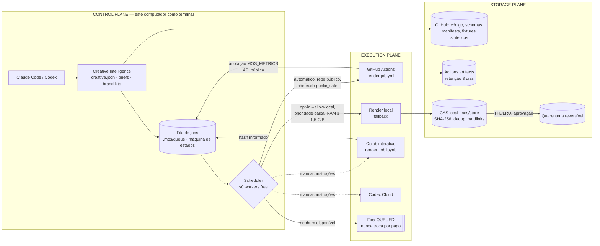

# Marketing OS — Cloud-First · Local-Light · Zero-Extra-Cost

Status: **implementação mínima funcional** (`ops/`), executor remoto gratuito **bloqueado** por billing lock da conta GitHub (verificado em 2026-10-08, execução `37716461840`). Nada pago é usado ou habilitado.

## Diagrama

## Planos e componentes

| Plano | Componente | Arquivo | Estado |
|---|---|---|---|
| Control | CLI do control plane | `ops/cli.ts` | OBSERVED (status/enqueue/dispatch/poll/complete/storage) |
| Control | Fila + máquina de estados | `ops/queue/store.ts` | TESTED (idempotente, transições ilegais rejeitadas) |
| Control | Scheduler | `ops/render/scheduler.ts` | TESTED (só free; fila se nada disponível; retries ≤ 3; concorrência 1; lease de 2 h) |
| Execution | `RenderWorker` | `ops/render/types.ts` | interface: sem GPU, `cost_class`, `mode`, `heavy_local` |
| Execution | GitHub Actions | `ops/render/workers.ts` + `.github/workflows/render-job.yml` | IMPLEMENTED, **NOT_RUN** (billing lock detectado automaticamente) |
| Execution | Local (fallback) | idem | MEASURED (Benchmark A); opt-in, `PRIORITY_BELOW_NORMAL`, 2 workers de frame |
| Execution | Colab | `ops/colab/render_job.ipynb` | manual, NOT_TESTED (exige seu login Google) |
| Execution | Codex Cloud | instruções via `dispatch --prefer codex-cloud` | manual, NOT_TESTED |
| Storage | CAS + manifest | `ops/storage/cas.ts` | TESTED (dedup, ids validados, escrita atômica) |
| Storage | Retenção | `ops/storage/retention.ts` | TESTED (plan → apply reversível → purge com flag separada) |
| Bench | Medidor de recursos | `ops/bench/measure.ts` | MEASURED (Windows e Linux) |

## Regras que o código garante
- `Scheduler.register()` lança erro para qualquer worker `cost_class !== 'free'`.
- Sem worker livre → job permanece `QUEUED` com o motivo no histórico. Não há fallback automático para render local nem para serviço pago.
- O worker GitHub só aceita jobs `public_safe: true` (o repositório é **público**); conteúdo de marca nunca é enviado.
- Push de job usa um índice temporário do Git: a árvore de trabalho do usuário não é tocada.
- Nenhuma exclusão sem `--approve`; exclusão irreversível só com `--i-approve-irreversible-delete` e só de quarentena com mais de 7 dias. Itens aprovados ou fixados nunca entram no plano.
- Caminhos fora de `MOS_HOME` só podem ser tocados se casarem com a allowlist de vazamentos conhecidos.

## Fábricas que compartilham esta base
- **Video Content Factory** — `experiments/remotion` (creative.v1 → Remotion frames → FFmpeg).
- **Static Creative Factory** — `factories/static` (brief → HTML/CSS → Chrome headless → PNG/JPG/WebP/PDF).
- Compartilhado: `factories/shared/brand-kits/`, `factories/shared/products/`, CAS/retenção/fila do `ops/`, QC, manifests no Git.
