# Architecture

```mermaid
flowchart LR
  CLI --> App[GenerateBatch]
  App --> Product[ProductKnowledge + provenance]
  Product --> Compliance[Compliance precheck]
  Compliance --> Context[Minimal context]
  Context --> Strategy[Deterministic strategy]
  Strategy --> Matrix[Cartesian matrix + dedup]
  Matrix --> Variants[Versioned UUID variants]
  Variants --> Controls[Asset reuse + cost route + budget]
  Controls --> Manifest[Production manifests]
  Manifest --> QA[Deterministic QA + transitions]
  QA --> Reports[Cost + efficiency reports]
  Reports --> Ports[Repository ports]
  Ports --> FS[Atomic filesystem adapter]
```

Modular monolith. Contracts define strict runtime schemas; domain owns provenance, identity, reuse and states; application orchestrates injected repositories/logger/clock. Creative factory creates traceable planning artifacts. AI modules prepare bounded future provider usage; the v0.1 never calls them externally. Policy and cost are deterministic controls.

Only infrastructure imports filesystem APIs. Domain hashing uses Node crypto, not external providers. Repository interfaces allow replacing filesystem with PostgreSQL. GenerateBatch.execute is an asynchronous use case independent of CLI, allowing a future worker adapter. No queues, HTTP server, DB, UI or media executors.

Brand differences are JSON configuration + policy, never brand-specific creative services. Internal conservative policy applies before creative work. REVIEW/BLOCK persists evidence with zero variants and WITHHELD matrix.

Identity chain: brand/product versions → source hashes → input_fingerprint → batch request hash → hypothesis UUID → angle/hook/visual/DNA/template/prompt versions → creative UUID → manifest. experiment_id links future analytics. Future approval references a content version hash; publishing interface includes idempotency key and creative version.

Persistence writes a complete staging directory then renames it under an exclusive key lock. Readers check schemas, checksums and ownership. Local checksums detect accidental changes; they are not signed attestations against a user who can rewrite the repository.
