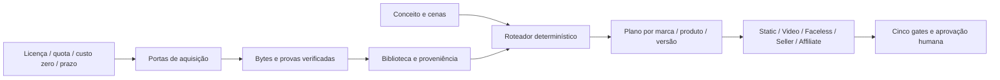

# Universal Asset Intelligence Engine

Incremento isolado sobre `codex/creative-quality-recovery`; PR de comércio #1 preservado separado. Nenhuma factory, contrato antigo, workflow ou lógica de compliance foi substituída. Gravação própria é opcional. Demonstração real e resultado comprovado continuam exigindo evidência autêntica, que pode vir de qualquer fonte autorizada, sem exigir filmagem do operador para cada SKU.

## Arquitetura e execução

- `contracts.ts`: registro estrito, direitos, escopo, quatro classes de fidelidade, tags e doze dimensões cinematográficas. `license_version` identifica versão publicada ou snapshot datado quando o provedor não publica número. Não inventamos versões.
- `router.ts`: seleção A–F entre assets materializados; G rejeita. `resolveScene` tenta aquisição apenas com capacidade cloud, licença, quota, prazo e custo incremental zero verificados. Portas recebem fornecedores externos; solicitações sem resultado não são assets. Falhas ficam explícitas, sem exceções contendo secrets.
- `stock.ts`: clientes oficiais Pexels/Pixabay, chave somente em memória, cinco resultados, timeout 15s, resposta máxima 500 KB, sem redirects, dez consultas/hora/processo, cache 24h. Pexels aceita pesquisa automatizada dentro de seus termos/quotas; Pixabay requer pedido humano e não pode sustentar pesquisa automatizada irrestrita para milhares de produtos. Cache e quota global devem ser fornecidos pelo chamador existente; o limite de processo não autoriza multiplicar processos para superar quotas. Nenhum scraper Mixkit.
- `library.ts`: verifica tamanho, SHA-256 do asset, prova de licença e evidência de resultados; caminhos relativos confinados também após resolução de symlinks. Assets privados ficam em `.mos/`; reutilização usa CAS existente, sem banco, fila ou fornecedor novo. Retenção vencida bloqueia uso, sem apagar arquivos automaticamente.
- `factory.ts`: binding opt-in para consumidores existentes; marca/produto/versão e metadata entram no fingerprint. Revalidar bytes com `verifyRecord`, depois `assertFactoryBinding`, imediatamente antes de renderizar. O benchmark usa esse caminho na Video Factory e gera plates de composição utilizáveis por consumidores estáticos. As integrações Seller/Affiliate são portas testadas; a ligação ao runtime do PR #1 aguarda sua integração e não foi fingida com import de módulo ausente nesta branch.

As features cinematográficas são análise editorial explícita, não reconhecimento visual automático nem score de conversão. Campo desconhecido não ganha pontos. Qualidade/realismo são triagem conservadora; nunca substituem revisão humana. O ranking mede fit, continuidade, qualidade, realismo, relevância, prazo e diversidade de assets. Reutilizar matéria-prima não autoriza repetir o anúncio completo ou reaproveitar aprovação de outro produto.

## Rotas disponíveis nesta entrega

| Rota | Evidência operacional | Restrição |
|---|---|---|
| A biblioteca licenciada | Stock existente verificado e usado no benchmark | Direitos e retenção por asset |
| B pesquisa oficial | Dois clientes implementados, respostas contratuais testadas | Chaves ausentes; nenhuma chamada live executada |
| C imagem sintética | Um cenário efetivamente gerado pela ferramenta integrada do Codex | Operação nesta sessão; não é endpoint gratuito universal para worker autônomo |
| D image-to-video | Capacidade e porta do roteador | Nenhum serviço gratuito de I2V foi executado/verificado; bloqueado |
| E composição | Foto original GRAND preservada sobre cenário/stock, três MP4 renderizados | Estudo interno; direitos de publicação e encaixe visual pendentes |
| F campanha aprovada | Aprovação vinculada a hash e escopo, com regressões | Não existe aprovação humana nova para GRAND |
| G rejeição | Direitos, budget, material/prova/qualidade insuficientes | Sem desenhos/slides de fallback disfarçados de filmagem |

O motor é reutilizável por categoria e idioma, mas esta entrega comprova somente GRAND e fixtures de contratos. Não comprovamos autonomia de milhares de SKUs, qualidade profissional, ROAS ou vendas. Isso exige catálogo autorizado, cobertura visual, quotas reais e revisão criativa.

## Reproduzir

1. `pnpm run build` e `pnpm test`.
2. Instalar somente as dependências já declaradas das factories, se ausentes. Disponibilizar `MOS_FFMPEG`, `MOS_FFPROBE`, `MOS_CHROME` ou ferramentas já existentes; não baixar modelos/GPU automaticamente.
3. Materializar os arquivos privados pelos hashes de [EVIDENCE.json](EVIDENCE.json): packshot original, dois clips Pexels, cenário gerado e Foley CC0. Mídia não é redistribuída no GitHub. Cenário novo gerado pelo mesmo prompt terá outro hash e precisa de registro/revisão novos.
4. `node universal-assets/benchmark.mjs`; `node universal-assets/review.mjs`.
5. Abrir `.mos/universal-assets/review.html`. Aprovar visualmente somente após avaliar todos os gates. Nenhuma produção em massa ou publicação é liberada pelo script.

[Licenças e proveniência](licenses.json) · [Modelos e nuvem](MODELS.md) · [Benchmark](BENCHMARK.md) · [Validação](VALIDATION.md).
